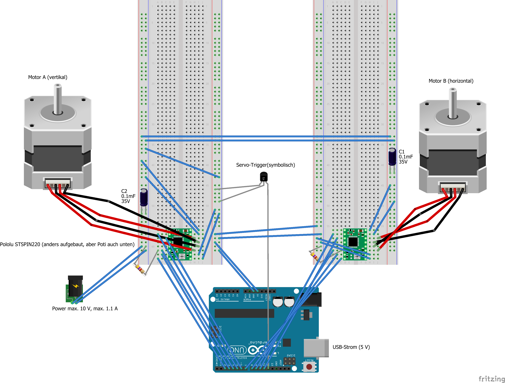

# PrickMotor 1

This is the code for the Arduino-microcontroller which powered the MEG-compatible Pinprick-Stimualator in it's first revision.

## Wiring Schmematic for PrickMotor1

## Motors and Arduino

